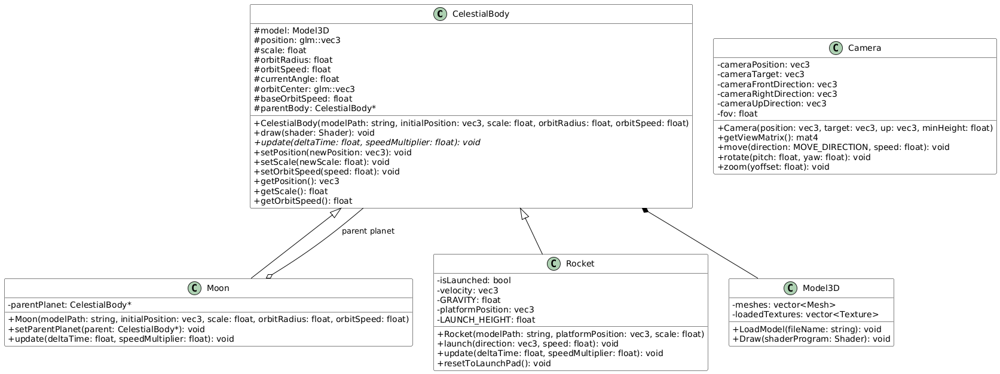
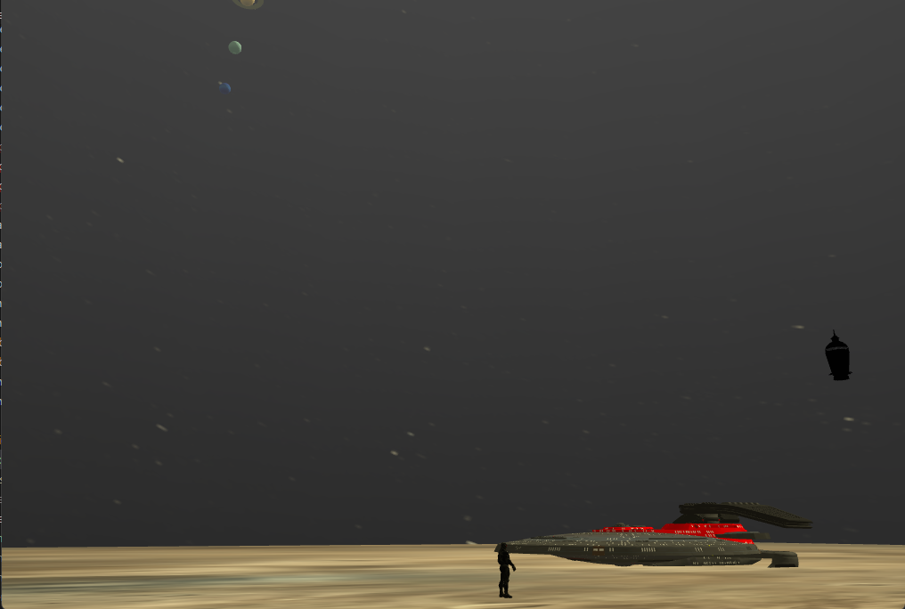
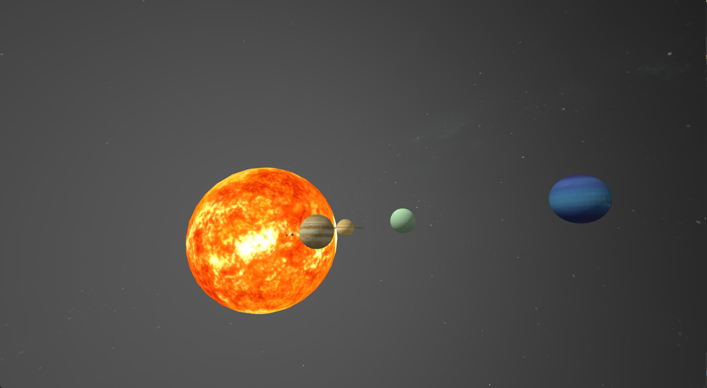
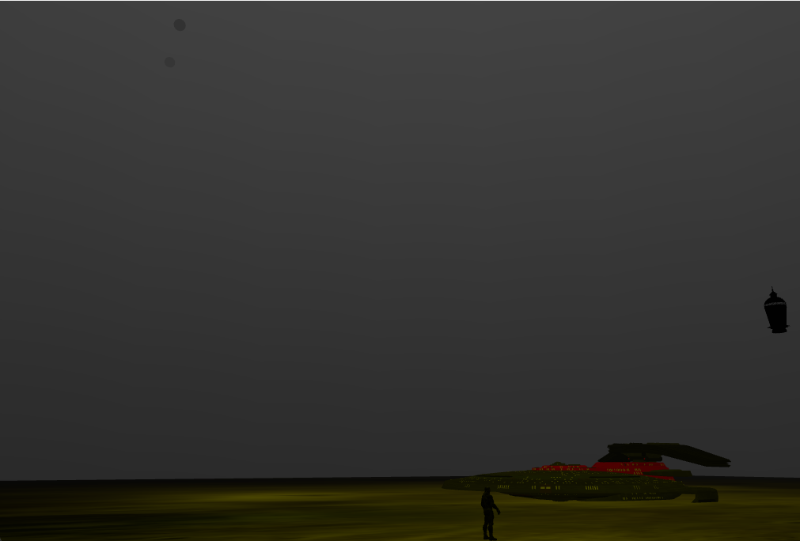

# OpenGL Adventures in Our Solar System

**Author:** Marcu-Cristian Petric  
**Affiliation:** Technical University of Cluj-Napoca

## Abstract

This project implements a 3D solar system simulation using OpenGL[^1], featuring realistic planetary orbits, interactive camera controls, and various visual effects. The system includes all eight planets of our solar system, complete with accurate relative scaling and orbital mechanics. Additional features include a dynamic weather system with rain particles affected by wind, a launchable rocket with physics-based trajectory, and multiple lighting sources. The implementation demonstrates advanced graphics programming concepts including shader management, particle systems, and celestial body movement calculations.

**Keywords:** OpenGL, Computer Graphics, Solar System Simulation, Particle Systems, 3D Graphics Programming

## Table of Contents
- [OpenGL Adventures in Our Solar System](#opengl-adventures-in-our-solar-system)
  - [Abstract](#abstract)
  - [Table of Contents](#table-of-contents)
  - [Subject Specification](#subject-specification)
    - [Core Requirements](#core-requirements)
    - [Technical Requirements](#technical-requirements)
    - [User Interaction Requirements](#user-interaction-requirements)
  - [Scenario](#scenario)
    - [Scene and Objects Description](#scene-and-objects-description)
    - [Functionalities](#functionalities)
  - [Implementation Details](#implementation-details)
    - [Orbital Mechanics](#orbital-mechanics)
    - [Sun Animation](#sun-animation)
    - [Graphics Model](#graphics-model)
    - [Class Hierarchy](#class-hierarchy)
    - [Data Structures](#data-structures)
  - [User Manual](#user-manual)
    - [Getting Started](#getting-started)
    - [Navigation Controls](#navigation-controls)
    - [Special Features](#special-features)
  - [Conclusions and Further Developments](#conclusions-and-further-developments)
    - [Achievements](#achievements)
    - [Future Development](#future-development)
  - [References](#references)

## Subject Specification

### Core Requirements
- Implementation of a complete solar system with eight planets orbiting around a central sun
- Realistic orbital mechanics with proper scaling and rotation patterns
- Dynamic lighting system featuring:
  - Directional light representing sunlight
  - Multiple point lights around the platform area
  - Day/night cycle toggle functionality
- Interactive camera system allowing free navigation through the scene
- Particle system implementation for weather effects

### Technical Requirements
- Development using OpenGL and C++
- Implementation of custom shader programs for lighting and effects
- Efficient handling of 3D models and textures
- Physics-based animations for rocket launches and particle systems
- Shadow mapping for enhanced visual realism

### User Interaction Requirements
- Camera controls for scene navigation
- Keyboard shortcuts for planet tracking
- Weather control system
- Rocket launch functionality
- View mode toggles (wireframe, solid, point)

## Scenario

### Scene and Objects Description
The solar system simulation recreates our cosmic neighborhood with a focus on both astronomical accuracy and interactive features. At the heart of the scene lies the Sun, serving as both the central celestial body and the primary light source. Eight planets, from Mercury to Neptune, orbit around this central star, each modeled with attention to relative scale and orbital characteristics.

The simulation features a sophisticated launch platform with illuminating lanterns and a dynamic weather system. A physics-based launchable rocket adds interactive elements to the experience.

### Functionalities
Navigation is achieved through WASD controls and mouse input, with number keys 1-8 for planet focus. Environmental controls include:
- Rain effects (R key)
- Wind direction (arrow keys)
- Day/night cycle (N key)
- Visualization modes (F for wireframe, P for point cloud)
- Rocket launches (spacebar)

## Implementation Details

### Orbital Mechanics
The project uses parametric circular orbits[^2] for computational efficiency:

$x = x_c + r \cos(\omega t)$

$z = z_c + r \sin(\omega t)$

$\theta = \omega t + \theta_0$

### Sun Animation
Shader-based procedural animation[^3] was chosen for performance and realism:

$displacement = A \sin(\omega t + d) \times noise(p)$

$pulse = \sin(0.5t + 1.5d)$

$flicker = \sin(2t + 5n)$

$brightness = 1.0 - 2.0\|texCoord - 0.5\|$

### Graphics Model
The pipeline includes:
- Multiple shader programs
- Texture management
- Shadow mapping
- Particle systems

### Class Hierarchy
The project's class structure is organized around a core celestial body system with specialized classes for different space objects and supporting functionality:

- **CelestialBody**: The base class for all celestial objects, handling basic orbital mechanics and rendering
  - **Moon**: Extends CelestialBody with specialized orbit behavior around planets
  - **Rocket**: Extends CelestialBody with physics-based launch and trajectory calculations
- **Model3D**: Handles 3D model loading and rendering, used by CelestialBody
- **Camera**: Manages view transformations and user perspective control

The class hierarchy emphasizes inheritance and composition relationships:
- CelestialBody contains a Model3D instance for rendering
- Moon and Rocket inherit from CelestialBody, extending its functionality
- Moon maintains a reference to its parent planet (CelestialBody)
- Camera operates independently but interacts with all rendered objects

This structure allows for efficient object management while maintaining clear separation of concerns between rendering, physics, and control systems.

### Data Structures
The project employs several core data structures:

```cpp
struct Vertex {
    glm::vec3 Position;
    glm::vec3 Normal;
    glm::vec2 TexCoords;
};

struct Buffers {
    GLuint VAO;
    GLuint VBO;
    GLuint EBO;
};

struct Texture {
    GLuint id;
    string type;
};
```

These structures form the foundation for 3D model representation and rendering in the OpenGL pipeline, with careful consideration for memory management and rendering efficiency. 

<p align="center">
  
  <br>
  <em>UML Class Diagram of the Solar System Simulation</em>
</p>

## User Manual

### Getting Started
Launch the application to view the solar system in daytime mode.

<p align="center">
  
  <br>
  <em>Solar System - Day View</em>
</p>

### Navigation Controls
- **Basic Movement:**
  - W/A/S/D - Move camera
  - Mouse Movement - Look around
  - Mouse Scroll - Zoom
- **Planet Selection:**
  - Keys 1-8 - Focus planets

<p align="center">
  
  <br>
  <em>Planetary View</em>
</p>

### Special Features
- **Environment Controls:**
  - N - Day/night toggle
  - R - Rain toggle
  - Arrow Keys - Wind control
- **Display Modes:**
  - F - Wireframe mode
  - P - Point cloud mode
- **Interactive Elements:**
  - Space Bar - Launch rocket

<p align="center">
  
  <br>
  <em>Solar System - Night View</em>
</p>

## Conclusions and Further Developments

### Achievements
- Realistic orbital mechanics
- Dynamic sun shader effects
- Interactive camera system
- Environmental effects
- Physics-based rocket system

### Future Development
- **Enhanced Physics:**
  - Gravitational interactions
  - Accurate Kepler orbits
  - Collision detection
- **Visual Improvements:**
  - Advanced atmospherics
  - Asteroid belt
  - Detailed textures
- **New Features:**
  - Multiple viewpoints
  - Educational displays
  - Mission system

## References

[^1]: Sellers, G., Wright, R. S., & Haemel, N. (2015). OpenGL SuperBible: Comprehensive Tutorial and Reference (7th ed.). Addison-Wesley Professional.

[^2]: Murray, C. D., & Dermott, S. F. (1999). Solar System Dynamics. Cambridge University Press.

[^3]: Bailey, M., & Cunningham, S. (2012). Graphics Shaders: Theory and Practice. CRC Press.

[^4]: de Vries, J. (2020). Learn OpenGL: Graphics Programming. https://learnopengl.com/

[^5]: Reeves, W. T. (1983). Particle Systems—A Technique for Modeling a Class of Fuzzy Objects. ACM Transactions on Graphics, 2(2), 91-108.